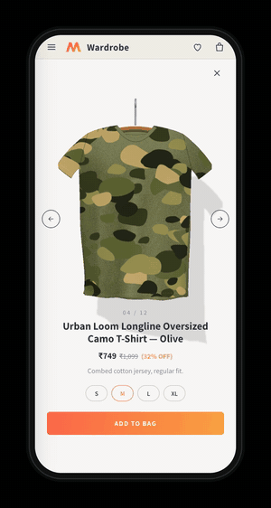
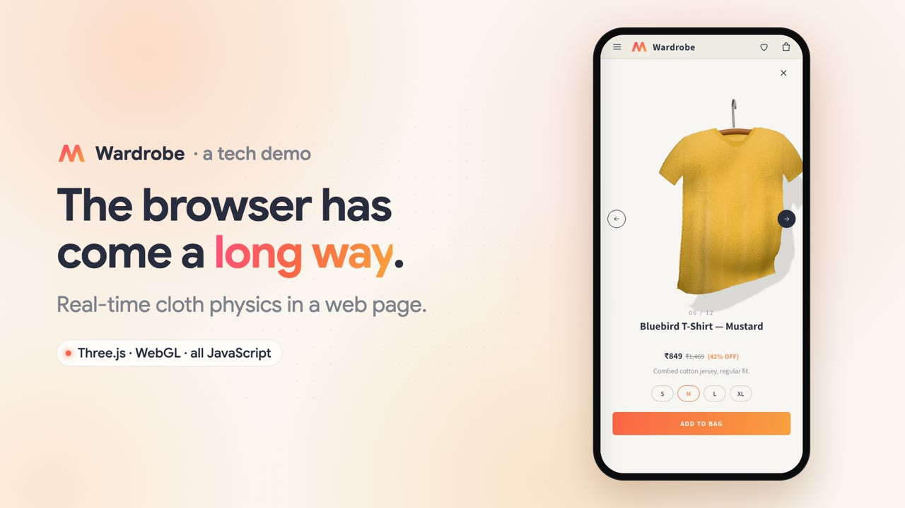
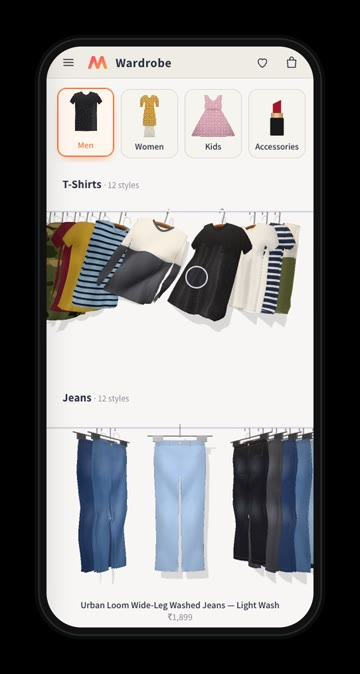
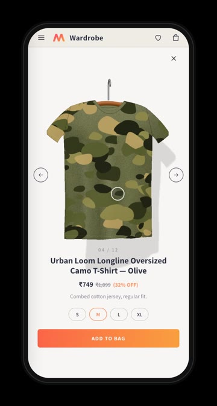
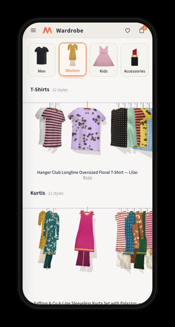
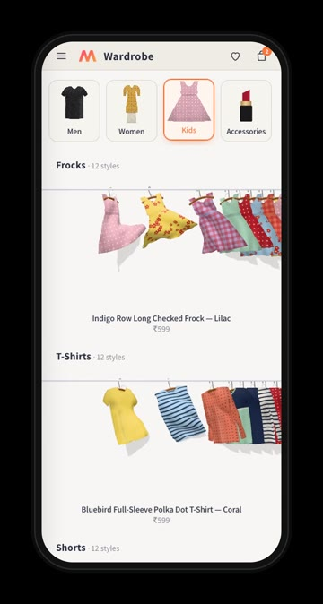
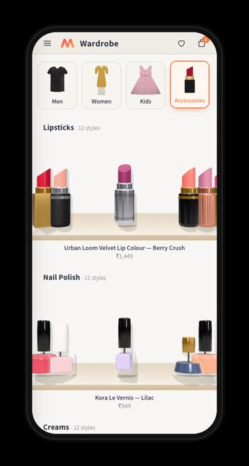
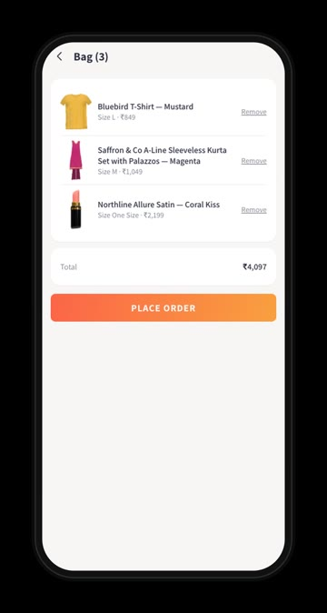
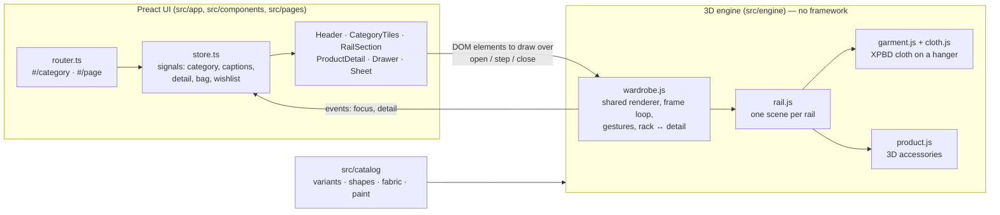

# M Wardrobe

**A tech demo: real-time cloth physics on a mobile web page.**
Every garment on the rack is a cloth simulation on a hanger, solved in plain JavaScript and drawn with WebGL through Three.js. No plugins, no app, no video, and no product photos: every texture is painted in code.

**▶ Live demo: [m-wardrobe.nvkudva.workers.dev](https://m-wardrobe.nvkudva.workers.dev)** (best on a phone)

<p align="center">
  
</p>

## Demo video

[](docs/m-wardrobe-demo.mp4)

*Click the image to open the 30-second video ([`docs/m-wardrobe-demo.mp4`](docs/m-wardrobe-demo.mp4)).*

## Screenshots

| Rack | Detail | Women | Kids | Accessories | Bag |
|:---:|:---:|:---:|:---:|:---:|:---:|
|  |  |  |  |  |  |

## What it does

- **Cloth on hangers.** Each piece hangs from a real hanger and swings, sways and settles under physics. Drag a rail and the clothes lag and flutter.
- **Tap to open, drag to turn.** Tapping the focused piece re-frames its rail to the full screen. Dragging turns and tips the piece in 3D, then it springs back. A long swipe steps to the next piece.
- **Fold, then fly.** *Add to bag* lifts the piece off the canvas, folds it like a shop-folded tee (sleeves in, bottom up) and arcs it into the bag icon, which shakes and counts up.
- **Accessories render too.** Lipsticks, nail polish and creams stand on a 2.5D table in the same scene.
- **A small app around it.** Categories (Men, Women, Kids, Accessories), a menu drawer, bag, orders, wishlist and profile pages, with real URLs (`#/women`, `#/bag`) so the back button and deep links work.

## Tech stack

| Layer | Tech |
|---|---|
| 3D rendering | [Three.js](https://threejs.org) r170 on WebGL 2 |
| Cloth physics | Custom XPBD solver in JavaScript (`src/engine/cloth.js`) |
| Garment art | Canvas 2D, painted procedurally (`src/catalog/paint.js`) |
| UI | [Preact](https://preactjs.com) + [@preact/signals](https://preactjs.com/guide/v10/signals/), TypeScript |
| Build | [Vite](https://vite.dev) 6, [Bun](https://bun.sh) |
| Hosting | Cloudflare Workers (static assets) |
| Demo recording | Playwright + ffmpeg (`scripts/record-demo.mjs`) |

## Architecture

The app is two halves that only meet through a narrow interface: a **framework-free 3D engine** and a **Preact UI** that sits on top of the canvas.



- **One renderer, many rails.** A single `WebGLRenderer` draws every rail into its own strip of one full-screen canvas using viewport and scissor rectangles. Opening a piece re-frames that rail to the full screen with the same pixels, so there is no jump.
- **The engine never touches UI markup.** The UI hands it the elements to draw over and listens to two events: `focus` (the rail's focused product changed) and `detail` (a piece opened, stepped or closed).
- **Garments are data.** `src/catalog/variants.js` holds recipes (cut, colours, prints, fit). Each product is painted onto a canvas (`paint.js`), cut into a cloth shape (`shapes.js`) and given fabric properties (`fabric.js`). Fit is a parameter: slim to wide, short to long, sleeveless to full sleeve.
- **DOM effects stay in the DOM.** The fold-and-fly is CSS 3D: a snapshot of the canvas split into six hinged panels, animated with the Web Animations API (`src/effects`).

### How it stays smooth

| Technique | Where |
|---|---|
| Settled cloth falls asleep and is carried rigidly by its hanger: one matrix, no per-vertex work | `src/engine/cloth.js` |
| Off-screen rails neither simulate nor draw | `src/engine/wardrobe.js` |
| Rails are stocked within a 10 ms budget per frame, so switching category never freezes the page | `src/engine/wardrobe.js` |
| Shadows are re-cast only when a rail's contents move, not on scroll | `src/engine/wardrobe.js` |
| Accessory geometry is built once and shared | `src/engine/product.js` |
| Pixel ratio capped at 2 | `src/engine/wardrobe.js` |

Measurements and the full list are in [`PERF.md`](PERF.md).

## Project layout

```
src/
  main.tsx              entry: start the router, render <App/>
  app/                  App.tsx (phone frame + screen), store.ts (signals), router.ts (hash routes)
  components/           Header, CategoryTiles, RailSection, ProductDetail, Drawer, Sheet, icons
  pages/                WardrobePage, BagPage, OrdersPage, ProfilePage, WishlistPage, HelpPage
  engine/               wardrobe.js, rail.js, garment.js, cloth.js, product.js, snapshot.js
  catalog/              variants.js, shapes.js, fabric.js, paint.js
  effects/              fold-and-fly, sparks, ripple
  data/                 demo account and orders
  styles/               base.css (tokens, reset, phone frame)
scripts/record-demo.mjs records the walkthrough video
docs/                   README media
```

## Run it locally

Needs [Bun](https://bun.sh) (or Node 20+ with npm).

```bash
bun install
bun run dev          # http://localhost:5173
```

On a desktop the app sits in a phone frame. On a phone or tablet it fills the screen. To try it on your phone, open the **Network** URL that Vite prints while both devices are on the same Wi-Fi.

| Command | What it does |
|---|---|
| `bun run dev` | Dev server with hot reload on port 5173 |
| `bun run build` | Production build into `dist/` |
| `bun run preview` | Serve the production build |
| `bun run typecheck` | TypeScript check of the UI layer |
| `bun run deploy` | Build, then deploy `dist/` to the `m-wardrobe` Cloudflare Worker (needs `wrangler login`) |

### Record the demo video

With the dev server running and `ffmpeg` installed:

```bash
node scripts/record-demo.mjs            # writes m-wardrobe-demo.mp4 (+ .json section timestamps)
```

It drives Chrome with Playwright at a phone viewport, warms up every page first, then records the full walkthrough at 60 fps.

## Notes

- This is a tech demo. The brand, products, prices, user and orders are made up.
- [MIT licensed](LICENSE).
